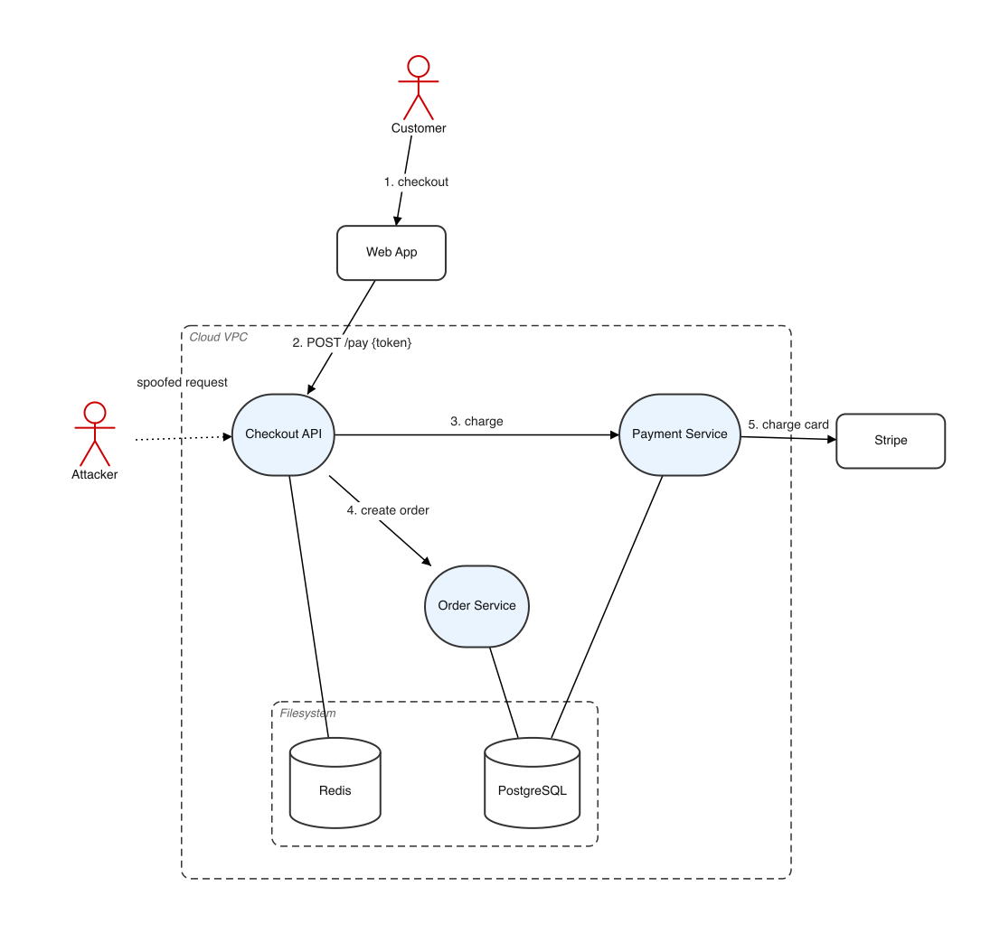
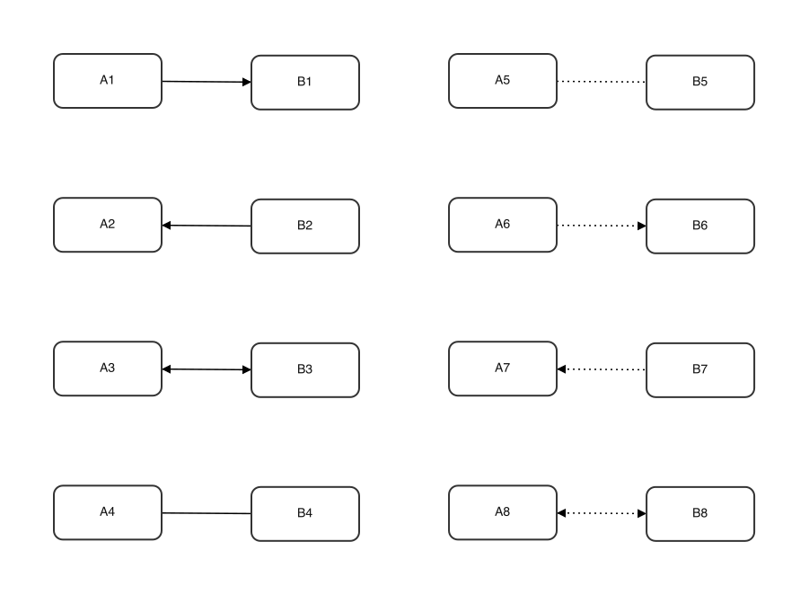
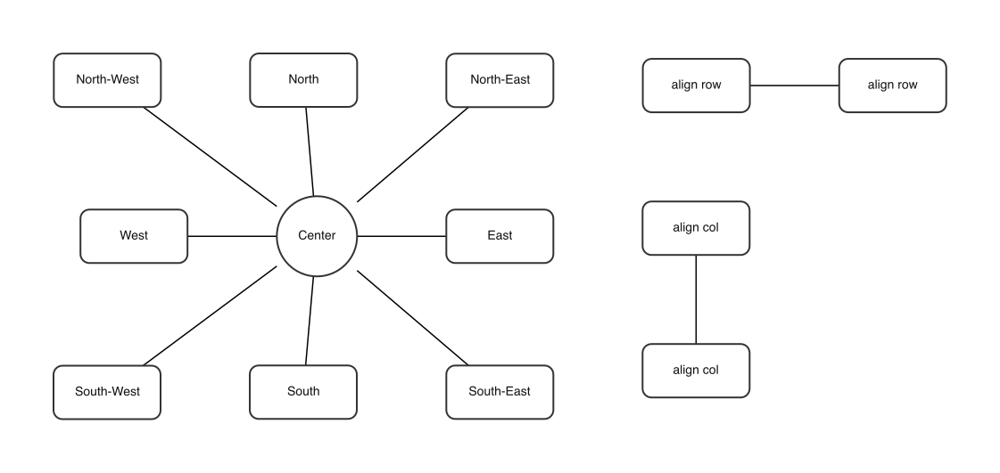

# graphgen

Constraint-based graph layout → PNG renderer. Alternative to [PlantUML](https://plantuml.com/) and [Mermaid](https://mermaid.js.org/) when you want to store your graphs in code, but want more control over the layout. Initially concaved to produce the scope and use-case diagrams required by the [Axis Security Development Model](https://help.axis.com/en-us/axis-security-development-model).

## Example



```text
// optional per-graph style overrides (here, a light fill for circles).
shapes {
    circle {
        color "#EAF4FF" // Blue
    }
}

// the box/circle/actor/database shapes plus the boundaries and groups
// that contain them.
nodes {
    actor customer: "Customer"
    box web: "Web App"
    boundary cloud: "Cloud VPC" {
        circle api: "Checkout API"
        group core {
            circle payments: "Payment Service"
            circle orders: "Order Service"
        }
        boundary container: "Filesystem" {
            database db: "PostgreSQL"
            database cache: "Redis"
        }
    }
    box stripe: "Stripe"
    actor attacker: "Attacker"
}

// connections between nodes; labelled ones trace the numbered flow,
// plain ones show static architecture links.
edges {
    customer --> web: "1. checkout"
    web --> api: "2. POST /pay {token}"
    api --> payments: "3. charge"
    api --> orders: "4. create order"
    payments --> stripe: "5. charge card"
    payments --- db
    orders --- db
    api --- cache
    attacker ..> api: "spoofed request"
}

// relative-placement rules the layout solver must satisfy.
constraints {
    customer top web
    web top api
    core right api
    payments top orders
    db bottom api
    cache bottom api
    cache left db
    align row db cache
    orders left payments
    orders bottom api
    stripe right payments
    attacker left api
}
```

## Install and run (Docker)

The recommended way to run `graphgen` is via Docker — no local Node or native
image libraries required.

Build once:

```bash
docker build -t graphgen .
```

Then render, mounting a folder so the PNG lands back on the host:

```bash
mkdir -p out
docker run --rm -v "$(pwd)/out:/app/out" graphgen demo/usecases/bookstore_uc1.ggn out/output.png
```

The image appears at `./out/output.png` on your machine. Replace the input and
output paths with your own as needed.

The output argument is optional. If you omit it, graphgen picks the output path
in this order:

1. CLI output argument (`tsx src/index.ts input.ggn out/output.png`)
2. Graph-local setting (`graph { outputPath "..." }` inside the rendered `.ggn`)
3. Global style setting (`style.jsonc` -> `graph.outputPath`)
4. Built-in fallback (`../graphs/{file}`)

`{file}` expands to the input filename with a `.png` extension. For example,
`checkout_scope.ggn` becomes `checkout_scope.png`. Relative paths are resolved
from the input graph's directory.

Example global default in `style.jsonc`:

```jsonc
{
  "graph": {
    "outputPath": "../graphs/{file}",
  },
}
```

Example per-graph override:

```text
graph {
        outputPath "./renders/{file}"
}
```

To override the styles, mount your own style file and pass it as the third
argument (same as the local run):

```bash
docker run --rm -v "$(pwd)/out:/app/out" -v "$(pwd)/my-style.jsonc:/app/my-style.jsonc" \
    graphgen demo/usecases/bookstore_uc1.ggn out/output.png my-style.jsonc
```

### Watch for changes

For local development, run:

```bash
npm run watch
```

This watches the current project and mirrors generated images into `renders/`.
To watch another path while respecting each graph's `outputPath`, the global
`style.jsonc` setting, and the built-in default, run the watcher directly:

```bash
npx tsx src/watch.ts path/to/graphs
```

You can also provide an output directory explicitly:

```bash
npx tsx src/watch.ts path/to/graphs path/to/renders
```

## Showcase

### Nodes

Declare nodes. These are the elements that will make up your graph:


```text
nodes {
    box boxNode: "Box"
    circle circleNode: "Circle"
    actor actorNode: "Actor"
    database dbNode: "Database"
    boundary boundaryNode: "Boundary" {
        box inside: "Inside"
        boundary innerBoundary: "Nested boundary" {
            box deep: "Deep"
        }
    }
}
```

### Edges

Connect nodes together with edges:



```text
edges {
    a1 --> b1
    a2 <-- b2
    a3 <--> b3
    a4 --- b4
    a5 ... b5
    a6 ..> b6
    a7 <.. b7
    a8 <..> b8
}
```

### Constraints

Apply alignment constraints and relationships between your nodes to force graph to look a certain way:



```text
constraints {
    // eight directions around a center
    n top center
    s bottom center
    e right center
    w left center
    ne topRight center
    nw topLeft center
    se bottomRight center
    sw bottomLeft center

    // the remaining constraint types
    orbit near hub
    align row rowA rowB
    align col colA colB
}
```

`align row` requires every listed node to have the same y coordinate, while
`align col` requires the same x coordinate.

**Constraints and alignments can target a whole group or boundary, not just
single nodes** — the id expands to all its members, so one rule places or aligns
an entire cluster (e.g. `core right api` puts the whole `core` group to the right
of `api`). Rules referencing an unknown id are skipped with a warning.

## Labels

Add a label to any node or edge with a trailing `: "..."`:

```text
box api: "Checkout API"      // node label (omit it and the id is used)
api --> db: "READ {rows}"    // edge label
```

See the [Edges](#edges) showcase for the arrow/line styles
and [Constraints](#constraints) for placement rules.

### Label formatting templates

Use `labelFormat` in the `graph { ... }` block to keep edge labels consistent
and readable.

```text
graph {
    labelFormat "{index}. {source} -> {target}: {label}"
}
```

You can use these placeholders:

- `{index}` (1-based edge index)
- `{source}`, `{target}`, `{label}`
- `{arrowSource}`, `{arrowTarget}`
- `{lineStyle}`, `{line}`

Behavior:

- Formatting is applied only to labelled edges.
- Unknown placeholders are left unchanged.
- If `labelFormat` is omitted or empty, labels are rendered as written.

## Reuse graph with new edges

In threat modeling, you often want to reuse a base graph and add new edges to
describe a specific data flow. Use `import "..."` and then declare the new
edges:

```text
import "../scopes/checkout_scope.ggn"

edges {
    customer --> api: "1. GET /checkout"
}
```

The imported graph contributes its nodes, boundaries, groups, constraints and
styles; only the file being rendered contributes edges.

## Styling

`style.jsonc` holds the global defaults:

- `graph.minGap` — minimum spacing enforced by ordering constraints.
- `graph.nodeGap` — minimum clear space kept between any two nodes (and between
  a node and boundaries it doesn't belong to).
- `graph.linkLength` — target (ideal) edge length, centre-to-centre. Kept as a
  flat constant so high-degree hubs don't fling their neighbours far away.
- `graph.iterations` — the three WebCola solver passes
  `[unconstrained, userConstraint, allConstraint]` (also overridable at runtime
  with `GRAPHGEN_ITERS=a,b,c`).
- `shapes.<name>` — per-shape `color`, `lineStyle` (`solid`/`dashed`),
  `minWidth`, `minHeight`, `borderRadius`, and optional `borderColor`. Unknown
  shapes fall back to a plain box.

### Layout engines: custom constraint vs cola

Set `graph.layout` to choose how nodes are positioned:

- `constraint` (default) — custom engine focused on predictable constraints and
  explicit validation of constraints and overlap rules.
- `cola` — legacy WebCola-only layout pass.

If the same setting appears in multiple places, this precedence applies:

1. `GRAPHGEN_LAYOUT` environment variable
2. per-graph `graph { layout "..." }`
3. global style `style.jsonc` (`graph.layout`)
4. default `constraint`

Examples:

Global default in `style.jsonc`:

```jsonc
{
  "graph": {
    "layout": "constraint",
  },
}
```

Per-graph override:

```text
graph {
        layout "cola"
}
```

You can also set `graph.layoutIterations` (or `GRAPHGEN_LAYOUT_ITERS`) to
control how many iterations the `constraint` engine can use before stopping.

A graph's own `shapes { ... }` block overrides global shape defaults for that
graph only, and a custom style file can be passed per render (the optional third
CLI argument).
Both `style.jsonc` and JSON inputs may contain `//` comments and trailing commas.
