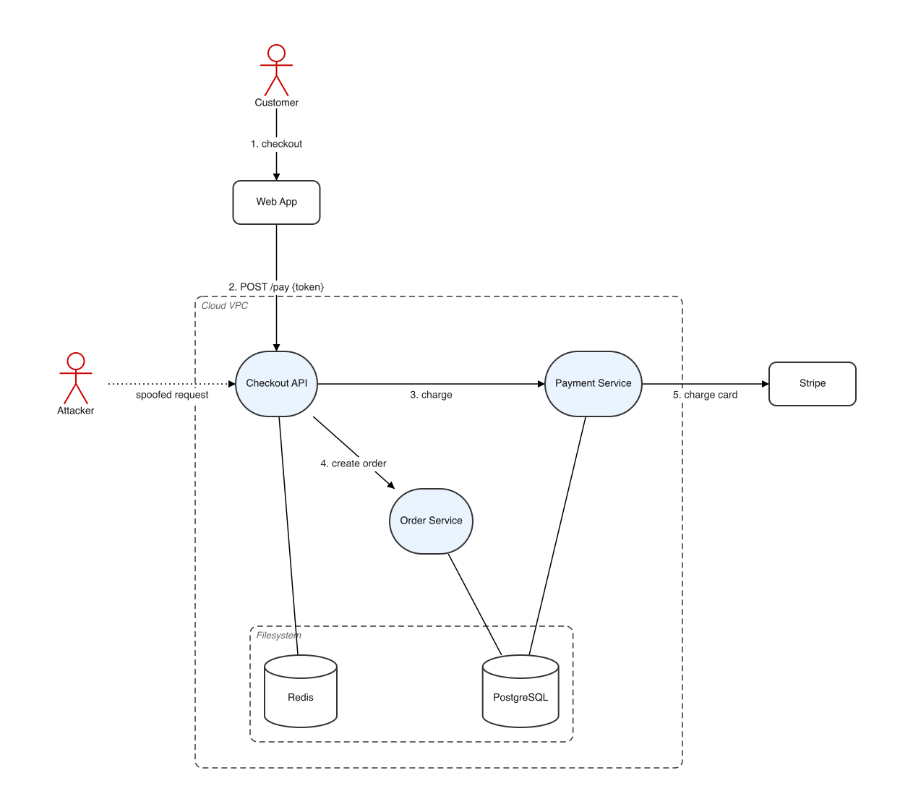
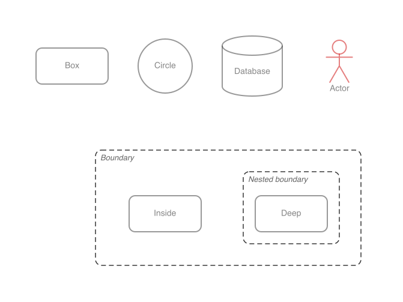
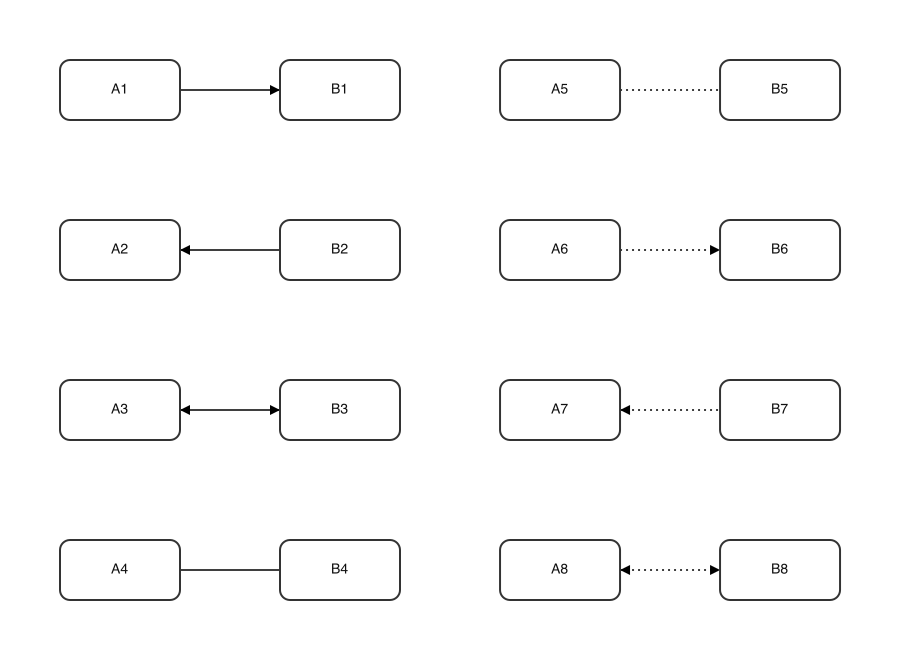
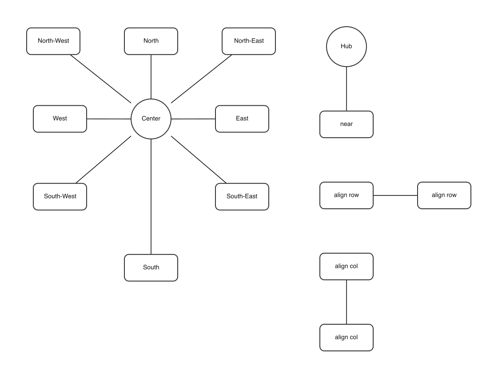

# graphgen

Constraint-based graph layout → PNG renderer. Alternative to [PlantUML](https://plantuml.com/) and [Mermaid](https://mermaid.js.org/) when you want to store your graphs in code, but want more control over the layout. Initially concaved to produce the scope and use-case diagrams required by the [Axis Security Development Model](https://help.axis.com/en-us/axis-security-development-model).

## Example



```text
// optional per-graph style overrides (here, a light fill for circles).
shapes {
    circle {
        color "#EAF4FF" // Blue
    }
}

// the box/circle/actor/database shapes plus the boundaries and groups
// that contain them.
nodes {
    actor customer: "Customer"
    box web: "Web App"
    boundary cloud: "Cloud VPC" {
        circle api: "Checkout API"
        group core {
            circle payments: "Payment Service"
            circle orders: "Order Service"
        }
        boundary container: "Filesystem" {
            database db: "PostgreSQL"
            database cache: "Redis"
        }
    }
    box stripe: "Stripe"
    actor attacker: "Attacker"
}

// connections between nodes; labelled ones trace the numbered flow,
// plain ones show static architecture links.
edges {
    customer --> web: "1. checkout"
    web --> api: "2. POST /pay {token}"
    api --> payments: "3. charge"
    api --> orders: "4. create order"
    payments --> stripe: "5. charge card"
    payments --- db
    orders --- db
    api --- cache
    attacker ..> api: "spoofed request"
}

// relative-placement rules the layout solver must satisfy.
constraints {
    customer top web
    web top api
    core right api
    payments top orders
    db bottom api
    cache bottom api
    cache left db
    align row db cache
    orders left payments
    orders bottom api
    stripe right payments
    attacker left api
}
```

## Install and run (Docker)

The recommended way to run `graphgen` is via Docker — no local Node or native
image libraries required.

Build once:

```bash
docker build -t graphgen .
```

Then render, mounting a folder so the PNG lands back on the host:

```bash
mkdir -p out
docker run --rm -v "$(pwd)/out:/app/out" graphgen demo/usecases/bookstore_uc1.ggn out/output.png
```

The image appears at `./out/output.png` on your machine. Swap in your own `.ggn`
input path and output name as needed.

The output argument is optional. A graph can instead define `outputPath` in its
`graph` block, for example `outputPath "../graphs/{file}"`. `{file}` expands to
the input filename with a `.png` extension, and configured relative paths are
resolved from the input graph's directory. An explicit CLI output path takes
precedence. The default style writes to `../graphs/{file}`.

To override the styles, mount your own style file and pass it as the third
argument (same as the local run):

```bash
docker run --rm -v "$(pwd)/out:/app/out" -v "$(pwd)/my-style.jsonc:/app/my-style.jsonc" \
    graphgen demo/usecases/bookstore_uc1.ggn out/output.png my-style.jsonc
```

## Showcase

### Nodes

Declare nodes. These are the elements that will make up your graph:



```text
nodes {
    box boxNode: "Box"
    circle circleNode: "Circle"
    actor actorNode: "Actor"
    database dbNode: "Database"
    boundary boundaryNode: "Boundary" {
        box inside: "Inside"
        boundary innerBoundary: "Nested boundary" {
            box deep: "Deep"
        }
    }
}
```

### Edges

Connect nodes together with edges:



```text
edges {
    a1 --> b1
    a2 <-- b2
    a3 <--> b3
    a4 --- b4
    a5 ... b5
    a6 ..> b6
    a7 <.. b7
    a8 <..> b8
}
```

### Constraints

Apply alignment constraints and relationships between your nodes to force graph to look a certain way:



```text
constraints {
    // eight directions around a center
    n top center
    s bottom center
    e right center
    w left center
    ne topRight center
    nw topLeft center
    se bottomRight center
    sw bottomLeft center

    // the remaining constraint types
    orbit near hub
    align row rowA rowB
    align col colA colB
}
```

**Constraints and alignments can target a whole group or boundary, not just
single nodes** — the id expands to all its members, so one rule places or aligns
an entire cluster (e.g. `core right api` puts the whole `core` group to the right
of `api`). Rules referencing an unknown id are skipped with a warning.

## Labels

Add a label to any node or edge with a trailing `: "..."`:

```text
box api: "Checkout API"      // node label (omit it and the id is used)
api --> db: "READ {rows}"    // edge label
```

See the [Edges](#edges) showcase for the arrow/line styles
and [Constraints](#constraints) for placement rules.

## Reuse graph with new edges

In threat modeling you often times may want to reuse a "base graph" with new edges, do describe a dataflow. This is supported with `import "..."`, then declaring new edges:

```text
import "../scopes/checkout_scope.ggn"

edges {
    customer --> api: "1. GET /checkout"
}
```

The imported graph contributes its nodes, boundaries, groups, constraints and
styles; only the file being rendered contributes edges.

## Layout architecture

`src/layout.ts` solves node and boundary positions and validates every hard
requirement: directional constraints, clearances, containment, straight-edge
intersections and crossings, and label collisions. It invokes minimization only
after finding a valid layout.

`src/minimize.ts` runs the fixed-point minimization cycle and rolls back a cycle
that does not improve the result. The implementations live in
`src/strategies/`: center compaction, edge shortening, blocker escape,
same-container swaps, equal-radius spreading for blocked neighbors of a shared
hub, and disconnected-node perimeter relocation.
Candidate moves are accepted only through the layout solver's validation and
measurement callbacks, so minimization cannot weaken or bypass layout
requirements.

### Inspecting minimization strategies

Each strategy has an isolated test in `tests/strategies/` and a matching JSON
case in `tests/strategies/cases/`. Run the tests with:

```sh
npm test -- --runInBand tests/strategies
```

Generate the visual series with:

```sh
npm run render-strategies
```

The command writes one folder per strategy below `renders/strategies/`.
`iteration-0000.png` is the input layout; each following image is an accepted
strategy iteration. The fixtures use a fixed viewport, so movement can be
compared directly from frame to frame. These series are separate from solver
debug frames controlled by `graph.debugFrameEvery`.

## Styling

`style.jsonc` holds the global defaults:

- `graph.minGap` — minimum spacing enforced by ordering constraints.
- `graph.nodeGap` — minimum clear space kept between any two nodes (and between
  a node and boundaries it doesn't belong to).
- `graph.linkLength` — target (ideal) edge length, centre-to-centre. Kept as a
  flat constant so high-degree hubs don't fling their neighbours far away.
- `graph.iterations` — the three WebCola solver passes
  `[unconstrained, userConstraint, allConstraint]` (also overridable at runtime
  with `GRAPHGEN_ITERS=a,b,c`).
- `graph.layout` — layout engine: `constraint` (default) or the legacy `cola`
  engine. Override it with `GRAPHGEN_LAYOUT`.
- `graph.layoutIterations` — maximum custom-solver iterations, default `1000`.
  Override it with `GRAPHGEN_LAYOUT_ITERS`.
- `graph.minimize` — post-layout generations that first move nodes toward the
  center, then shorten edges, escape blocked local minima, and swap nodes in the
  same container when that reduces total edge length. A fifth stage spreads
  blocked neighbors of a shared hub to an equal radius with minimum node-gap
  separation, and a sixth relocates edge-free perimeter nodes around nearby
  components to reduce rendered area. Those six stages repeat until rendered
  size no longer improves; an equal-size result may also be retained when it
  shortens total edge length. Every step preserves all hard constraints, and
  edge shortening may grow the rendered area by at most 5% within a cycle. It
  defaults to `100`; set it to `0` to disable compaction. Override it with
  `GRAPHGEN_MINIMIZE`.
- `graph.debugFrameEvery` — write a solver progress PNG every N iterations. It
  defaults to `0` (disabled); set it to `5`, for example, to write frames beside
  the output in `<output-name>.frames/`. Override it with
  `GRAPHGEN_DEBUG_FRAMES`.
- `shapes.<name>` — per-shape `color`, `lineStyle` (`solid`/`dashed`),
  `minWidth`, `minHeight`, `borderRadius`, and optional `borderColor`. Unknown
  shapes fall back to a plain box.

Within a graph's `graph { ... }` block, `labelFormat` is an optional template
applied to each labelled edge before duplicate edges are merged. It receives
`{index}` (one-based) plus every parsed edge property, such as `{source}`,
`{target}`, `{label}`, `{arrowSource}`, `{arrowTarget}`, `{lineStyle}`, and
`{line}`. An empty value leaves labels unchanged.

A graph's own `shapes { ... }` block overrides global shape defaults for that
graph only, and a custom style file can be passed per render (the optional third
CLI argument).
Both `style.jsonc` and JSON inputs may contain `//` comments and trailing commas.
