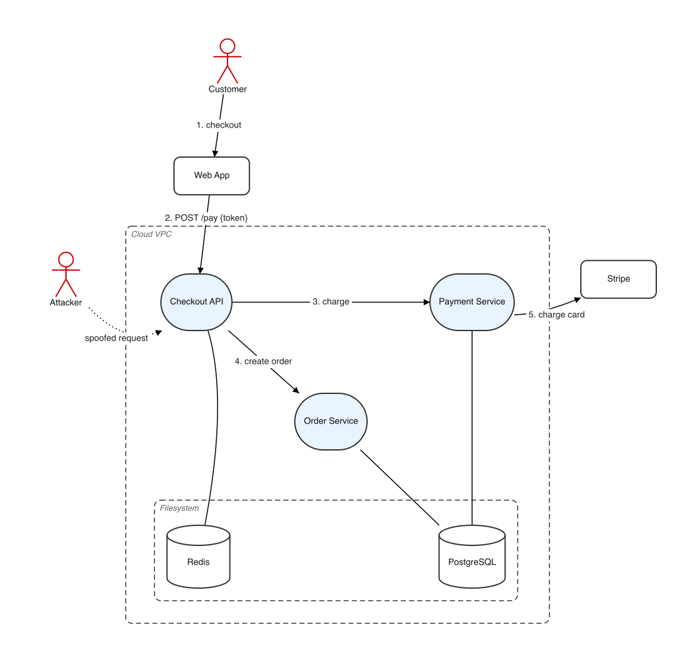
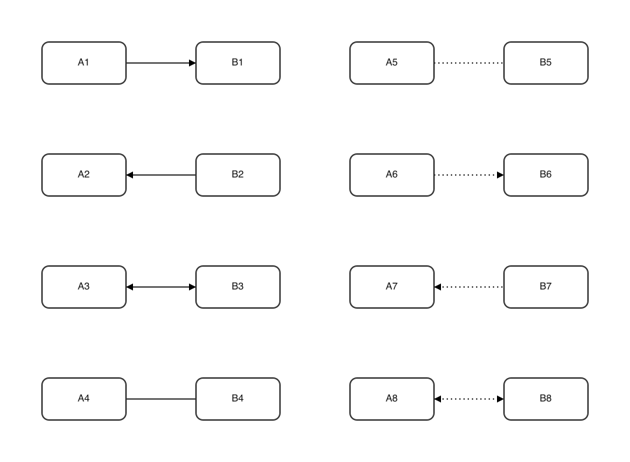

# graph-gen

Constraint-based graph layout → PNG renderer. Alternative to [PlantUML](https://plantuml.com/) and [Mermaid](https://mermaid.js.org/) when you want to store your graphs in code, but want more control over the layout. Initially conceived to produce the scope and use-case diagrams required by the [Axis Security Development Model](https://help.axis.com/en-us/axis-security-development-model).

## Install

Choose either npm or Docker.

### npm

Install [Node.js and npm](https://nodejs.org/) (Node.js 20.19+, 22.13+ or
24+). Once `graph-gen` is published to npm, install its prebuilt CLI globally:

```bash
npm install -g graph-gen
```

Ensure npm's global bin directory is on your `PATH`. Before the first npm
release, you can instead install from a source checkout:

```bash
git clone https://github.com/voxlz/graph-gen.git
cd graph-gen
npm ci
npm run build
npm link
```

The linked command depends on that checkout; rerun `npm run build` after
updating the source. If the native `canvas` dependency cannot be installed, see the
[node-canvas installation instructions](https://github.com/Automattic/node-canvas#installation).

### Docker

Install [Docker](https://docs.docker.com/get-docker/) and start its daemon, then
clone the repository and build the image:

```bash
git clone https://github.com/voxlz/graph-gen.git
cd graph-gen
docker build -t graph-gen .
```

Define this shell function to expose the same `graph-gen` command. Add it to
your shell's startup file to keep it available in future sessions:

```bash
graph-gen() {
    docker run --rm -i -v "$PWD:/work" -w /work \
        -e GRAPH_GEN_LAYOUT -e GRAPH_GEN_LAYOUT_ITERS \
        -e GRAPH_GEN_ITERS -e GRAPH_GEN_LABEL_NODES \
        -e GRAPH_GEN_CONSTRAINT_HINTS -e GRAPH_GEN_MINIMIZE \
        -e GRAPH_GEN_DEBUG_FRAMES -e GRAPH_GEN_FORCE_DEBUG_FRAMES \
        -e GRAPH_GEN_DUMP -e GRAPH_GEN_WARM_START \
        -e GRAPHGEN_LAYOUT -e GRAPHGEN_LAYOUT_ITERS \
        -e GRAPHGEN_ITERS -e GRAPHGEN_LABEL_NODES \
        -e GRAPHGEN_CONSTRAINT_HINTS -e GRAPHGEN_MINIMIZE \
        -e GRAPHGEN_DEBUG_FRAMES -e GRAPHGEN_FORCE_DEBUG_FRAMES \
        -e GRAPHGEN_DUMP -e GRAPHGEN_WARM_START \
        graph-gen "$@"
}
```

The function mounts the current directory at `/work`. Run it from a directory
containing the input, imported graphs, custom style and output paths; use paths
relative to that directory. Files outside it, including the default `../graphs`
output directory, are not available on the host unless separately mounted.
Environment-variable file paths must also refer to paths inside `/work`.

## Run

From a directory containing a graph:

```bash
graph-gen graph.ggn out/graph.png
graph-gen --help
graph-gen --version
```

The renderer formats `.ggn` input files in place. The output directory is
created if needed.

The output argument is optional. If you omit it, graph-gen picks the output path
in this order:

1. CLI output argument (`graph-gen input.ggn out/output.png`)
2. Graph-local setting (`graph { outputPath "..." }` inside the rendered `.ggn`)
3. Global style setting (`style.jsonc` -> `graph.outputPath`)
4. Built-in fallback (`../graphs/{file}`)

`{file}` expands to the input filename with a `.png` extension. For example,
`checkout_scope.ggn` becomes `checkout_scope.png`. Relative paths are resolved
from the input graph's directory.

Example global default in `style.jsonc`:

```jsonc
{
  "graph": {
    "outputPath": "../graphs/{file}",
  },
}
```

Example per-graph override:

```text
graph {
        outputPath "./renders/{file}"
}
```

To override the styles, pass a style file as the third argument:

```bash
graph-gen graph.ggn out/graph.png my-style.jsonc
```

### Watch for changes

Use `--watch` (or `-w`) to watch a file or directory, respecting each graph's
`outputPath`, the global `style.jsonc` setting, and the built-in default:

```bash
graph-gen --watch path/to/graphs
```

You can also provide an output directory explicitly:

```bash
graph-gen --watch path/to/graphs path/to/renders
```

With the Docker function, specify an output directory inside the mounted
current directory and keep the command running.

## Showcase

### Example



```text
// optional per-graph style overrides (here, a light fill for circles).
shapes {
    circle {
        color "#EAF4FF" // Blue
    }
}

// the box/circle/actor/database shapes plus the boundaries and groups
// that contain them.
nodes {
    actor customer: "Customer"
    box web: "Web App"
    boundary cloud: "Cloud VPC" {
        circle api: "Checkout API"
        group core {
            circle payments: "Payment Service"
            circle orders: "Order Service"
        }
        boundary container: "Filesystem" {
            database db: "PostgreSQL"
            database cache: "Redis"
        }
    }
    box stripe: "Stripe"
    actor attacker: "Attacker"
}

// connections between nodes; labelled ones trace the numbered flow,
// plain ones show static architecture links.
edges {
    customer --> web: "1. checkout"
    web --> api: "2. POST /pay {token}"
    api --> payments: "3. charge"
    api --> orders: "4. create order"
    payments --> stripe: "5. charge card"
    payments --- db
    orders --- db
    api --- cache
    attacker ..> api: "spoofed request"
}

// relative-placement rules the layout solver must satisfy.
constraints {
    customer top web
    web top api
    core right api
    payments top orders
    db bottom api
    cache bottom api
    cache left db
    align row db cache
    orders left payments
    orders bottom api
    stripe right payments
    attacker left api
}
```

## Install and run (Docker)

The recommended way to run `graph-gen` is via Docker — no local Node or native
image libraries required.

Build once:

```bash
docker build -t graph-gen .
```

Then render, mounting a folder so the PNG lands back on the host:

```bash
mkdir -p out
docker run --rm -v "$(pwd)/out:/app/out" graph-gen demo/usecases/bookstore_uc1.ggn out/output.png
```

The image appears at `./out/output.png` on your machine. Replace the input and
output paths with your own as needed. Run with `--help` for all arguments and
environment variables, or `--version` for the installed version.

The output argument is optional. If you omit it, graph-gen picks the output path
in this order:

1. CLI output argument (`tsx src/index.ts input.ggn out/output.png`)
2. Graph-local setting (`graph { outputPath "..." }` inside the rendered `.ggn`)
3. Global style setting (`style.jsonc` -> `graph.outputPath`)
4. Built-in fallback (`../graphs/{file}`)

`{file}` expands to the input filename with a `.png` extension. For example,
`checkout_scope.ggn` becomes `checkout_scope.png`. Relative paths are resolved
from the input graph's directory.

Example global default in `style.jsonc`:

```jsonc
{
  "graph": {
    "outputPath": "../graphs/{file}",
  },
}
```

Example per-graph override:

```text
graph {
        outputPath "./renders/{file}"
}
```

To override the styles, mount your own style file and pass it as the third
argument (same as the local run):

```bash
docker run --rm -v "$(pwd)/out:/app/out" -v "$(pwd)/my-style.jsonc:/app/my-style.jsonc" \
    graph-gen demo/usecases/bookstore_uc1.ggn out/output.png my-style.jsonc
```

### Watch for changes

For local development, run:

```bash
npm run watch
```

This watches the current project and mirrors generated images into `renders/`.
To watch another path while respecting each graph's `outputPath`, the global
`style.jsonc` setting, and the built-in default, use `--watch` (or `-w`):

```bash
npx tsx src/index.ts --watch path/to/graphs
```

You can also provide an output directory explicitly:

```bash
npx tsx src/index.ts --watch path/to/graphs path/to/renders
```

With Docker, mount the graphs and keep the container running:

```bash
docker run --rm -v "$(pwd):/work" graph-gen --watch /work/graphs /work/renders
```

## Showcase

### Nodes

Declare nodes. These are the elements that will make up your graph:


```text
nodes {
    box boxNode: "Box"
    circle circleNode: "Circle"
    actor actorNode: "Actor"
    database dbNode: "Database"
    boundary boundaryNode: "Boundary" {
        box inside: "Inside"
        boundary innerBoundary: "Nested boundary" {
            box deep: "Deep"
        }
    }
}
```

### Edges

Connect nodes together with edges:



```text
edges {
    a1 --> b1
    a2 <-- b2
    a3 <--> b3
    a4 --- b4
    a5 ... b5
    a6 ..> b6
    a7 <.. b7
    a8 <..> b8
}
```

### Constraints

Apply alignment constraints and relationships between your nodes to force graph to look a certain way:


```text
constraints {
    // eight directions around a center
    n top center
    s bottom center
    e right center
    w left center
    ne topRight center
    nw topLeft center
    se bottomRight center
    sw bottomLeft center

    // the remaining constraint types
    orbit near hub
    align row rowA rowB
    align col colA colB
}
```

`align row` requires every listed node to have the same y coordinate, while
`align col` requires the same x coordinate.

**Constraints and alignments can target a whole group or boundary, not just
single nodes** — the id expands to all its members, so one rule places or aligns
an entire cluster (e.g. `core right api` puts the whole `core` group to the right
of `api`). Rules referencing an unknown id are skipped with a warning.

## Labels

Add a label to any node or edge with a trailing `: "..."`:

```text
box api: "Checkout API"      // node label (omit it and the id is used)
api --> db: "READ {rows}"    // edge label
```

See the [Edges](#edges) showcase for the arrow/line styles
and [Constraints](#constraints) for placement rules.

### Label formatting templates

Use `labelFormat` in the `graph { ... }` block to keep edge labels consistent
and readable.

```text
graph {
    labelFormat "{index}. {source} -> {target}: {label}"
}
```

You can use these placeholders:

- `{index}` (1-based edge index)
- `{source}`, `{target}`, `{label}`
- `{arrowSource}`, `{arrowTarget}`
- `{lineStyle}`, `{line}`

Behavior:

- Formatting is applied only to labelled edges.
- Unknown placeholders are left unchanged.
- If `labelFormat` is omitted or empty, labels are rendered as written.

### Edge label placement

Edge label lines wider than `labelMaxWidth` (default `220` px) are wrapped at
spaces; set it to `0` in the `graph { ... }` block to turn wrapping off.

With the `curved` and `orthogonal` engines, each edge label touches its own
edge, centred on it where there is room. A label beside its edge still has its
edge pass through its middle, so it never drifts far from the edge. Labels keep clear of nodes (so
arrowheads stay visible), other labels and other edges.

With `curved`, a label that can't fit beside its edge stays where there is room
and the edge bends to reach it, as long as the bend clears nodes, boundaries and
other labels. With `orthogonal`, the edge similarly reroutes through the label
when a clear route is available without adding crossings or hiding bends.

With either engine, labels that still can't touch their edge become label nodes and
the graph is laid out again: each such label pushes other nodes away and its
edge is routed through it. This repeats until every label touches its edge. Control this with `labelNodes` in the
`graph { ... }` block (or `GRAPH_GEN_LABEL_NODES`):

- `auto` (default): only for labels that can't touch their edge otherwise.
- `true`: always. Every label sits on its edge, at the cost of larger layouts.
- `false`: never.

If an orthogonal edge still cannot reach its label, the renderer warns and keeps
the original edge and detached label.

### Group labels

Visible boundary titles are label obstacles in every render mode: nodes, edges
and other labels keep clear of them, including edges entering or leaving that
boundary. Boundaries reserve enough space for long or multiline titles and for
nested group labels, even when smaller padding is configured. Hidden groups
(`draw false`) do not reserve title space.

Orthogonal edge runs also keep at least 6 px from parallel group borders.
Edges can still cross a border to enter or leave a group.
After labels are placed, orthogonal routes are simplified again to remove
redundant doglegs while preserving label contact and collision clearances.
This rejects immediate backtracking and prefers fewer bends over 20 px
interior sections, while retaining the preference for 20 px endpoint approaches.

## Reuse graph with new edges

In threat modeling, you often want to reuse a base graph and add new edges to
describe a specific data flow. Use `import "..."` and then declare the new
edges:

```text
import "../scopes/checkout_scope.ggn"

edges {
    customer --> api: "1. GET /checkout"
}
```

The imported graph contributes its nodes, boundaries, groups, constraints and
styles; only the file being rendered contributes edges.

## Styling

`style.jsonc` holds the global defaults:

- `graph.minGap` — minimum spacing enforced by ordering constraints.
- `graph.nodeGap` — minimum clear space kept between any two nodes (and between
  a node and boundaries it doesn't belong to).
- `graph.linkLength` — target (ideal) edge length, centre-to-centre. Kept as a
  flat constant so high-degree hubs don't fling their neighbours far away.
- `graph.iterations` — the three WebCola solver passes
  `[unconstrained, userConstraint, allConstraint]` (also overridable at runtime
  with `GRAPH_GEN_ITERS=a,b,c`).
- `shapes.<name>` — per-shape `color`, `lineStyle` (`solid`/`dashed`),
  `minWidth`, `minHeight`, `borderRadius`, and optional `borderColor`. Unknown
  shapes fall back to a plain box.

### Layout engines

Set `graph.layout` to choose how nodes and edges are arranged:

| Engine             | Edge style and crossing behavior                                                                                        | Benefits and trade-offs                                                                                                                                        |
| ------------------ | ----------------------------------------------------------------------------------------------------------------------- | -------------------------------------------------------------------------------------------------------------------------------------------------------------- |
| `curved` (default) | Single smooth curves route around obstacles and penalize crossings.                                                     | A good general-purpose choice for compact diagrams: edges can bend instead of pushing nodes apart. Labels are placed on or beside their edges.                 |
| `orthogonal`       | Horizontal and vertical segments with 90° bends route around obstacles and strongly penalize crossings.                 | A structured, schematic look that makes direction and parallel connections easy to follow. Detours can add bends or space.                                     |
| `constraint`       | Straight edges; the solver rejects crossings between edges without a shared endpoint and edges through unrelated nodes. | Useful when straight, crossing-free connections are important. Nodes may need more space, and the solver can fail if it cannot find a valid layout.            |
| `cola`             | Straight edges from WebCola; edges may cross one another, nodes or labels.                                              | A simple stress-based layout and useful baseline for comparison, especially when compactness matters more than avoiding crossings.                             |
| `force`            | Straight edges from a force-directed starting layout, followed by constraint repair.                                    | Uses attraction and repulsion to find an arrangement before enforcing the straight-edge constraints. If repair fails, it falls back to a constraint grid seed. |

`curved` and `orthogonal` try to avoid obstacles and crossings, but routing is
not a guarantee that every graph can be drawn without them. Both try several
starting layouts and score the routed results for crossings, obstacle hits,
size and edge length. They also support automatic label nodes to help labels
touch their edges; see [Edge label placement](#edge-label-placement).

Orthogonal routes favor side-centred connections, separated parallel runs and
long, balanced sections. Small alignment differences do not introduce extra
bends, and labels keep a no-turn margin so the edge direction remains visible.
Choose `curved` for a softer look, `orthogonal` for a diagram-like style, or
`constraint` when avoiding crossings with straight edges is more important
than compactness.

Environment variables use the `GRAPH_GEN_` prefix. The former `GRAPHGEN_`
prefix remains supported as a deprecated alias; if both are set, `GRAPH_GEN_`
takes precedence.

If the same setting appears in multiple places, this precedence applies:

1. `GRAPH_GEN_LAYOUT` environment variable
2. per-graph `graph { layout "..." }`
3. global style `style.jsonc` (`graph.layout`)
4. default `curved`

Examples:

Global default in `style.jsonc`:

```jsonc
{
  "graph": {
    "layout": "curved",
  },
}
```

Per-graph override:

```text
graph {
        layout "cola"
}
```

You can also set `graph.layoutIterations` (or `GRAPH_GEN_LAYOUT_ITERS`) to
control how many iterations the `constraint` engine can use before stopping.

From a source checkout, to compare engines on a folder of graphs, run
`npm run benchmark -- <folder>`. It renders every `.ggn` file with each
engine in `BENCH_ENGINES` (default `curved,cola`) and reports image area,
edge lengths, crossings, edges through nodes, label collisions, and layout time.
`BENCH_FILTER` limits the graphs, `BENCH_JOBS=1` gives reliable timings, and
Cola results are cached (`BENCH_FRESH=1` re-renders them).

The installed CLI uses a precompiled renderer. In a source checkout, the
watcher, `render-all`, `generate` and benchmark rebuild the bundle when the
source changes; the watcher renders up to four changed graphs in parallel.

A graph's own `shapes { ... }` block overrides global shape defaults for that
graph only, and a custom style file can be passed per render (the optional third
CLI argument).
Both `style.jsonc` and JSON inputs may contain `//` comments and trailing commas.
