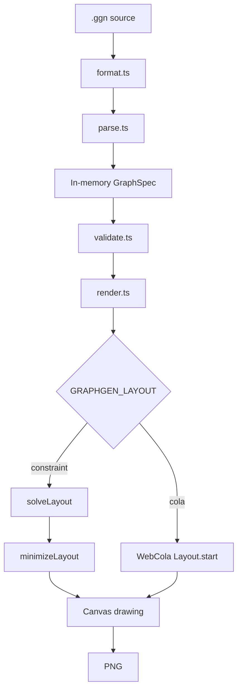

# Graph Rendering Flow

```mermaid
flowchart TD
  source[.ggn source] --> format[format.ts]
  format --> parse[parse.ts]
  parse --> spec[In-memory GraphSpec]
  spec --> validate[validate.ts]
  validate --> render[render.ts]
  render --> engine{GRAPHGEN_LAYOUT}
  engine -->|constraint| solve[solveLayout]
  solve --> minimize[minimizeLayout]
  engine -->|cola| cola[WebCola Layout.start]
  minimize --> draw[Canvas drawing]
  cola --> draw
  draw --> png[PNG]
```
